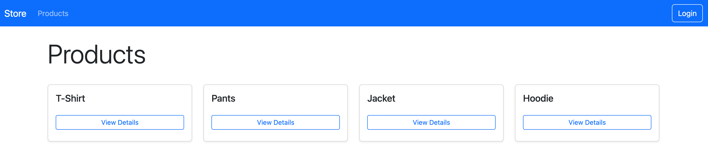
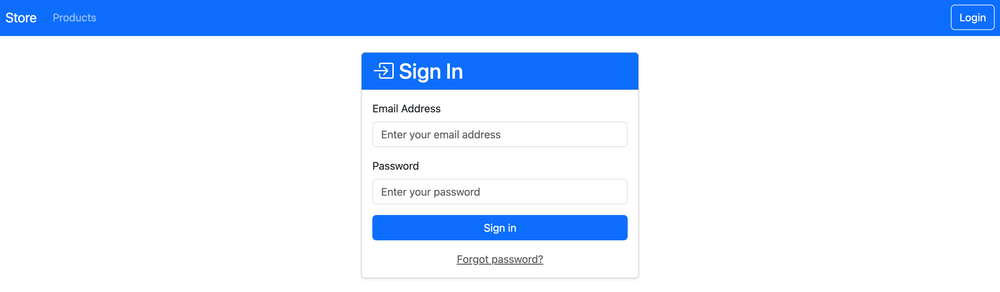
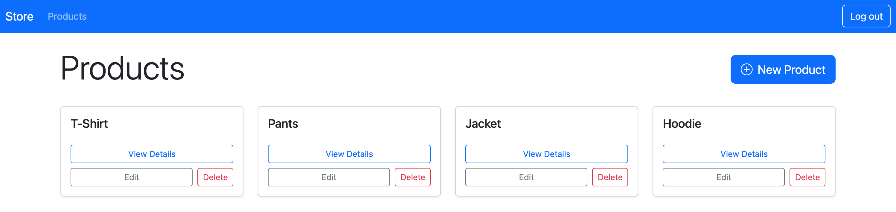
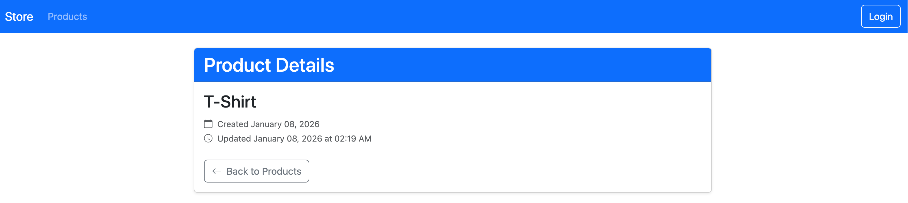
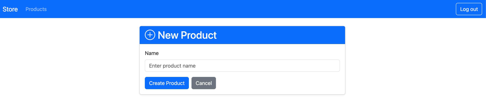
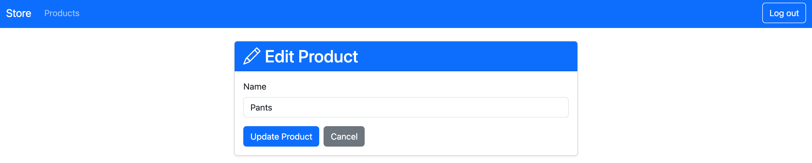

# Store

A modern product management application built with Rails 8 and Bootstrap 5.

## Quick Start

```bash
# Install dependencies
bundle install

# Setup database
bin/rails db:setup

# Start server
bin/rails server
```

Visit `http://localhost:3000`

## Test Login

**Email:** test@gmail.com
**Password:** test

## Features

- Modern Bootstrap 5 UI with responsive design
- Product CRUD operations (Create, Read, Update, Delete)
- User authentication with session management
- Password reset functionality
- Public product browsing, authenticated product management

## Screenshots

### Home Page (Unauthenticated)


---

### Login Page


---

### Home Page (Authenticated)


---

### Product Details


---

### New Product


---

### Edit Product


## Tech Stack

- **Ruby:** 4.0.0
- **Rails:** 8.1.1
- **Database:** SQLite3
- **Frontend:** Bootstrap 5, Hotwire (Turbo + Stimulus)
- **Authentication:** Rails 8 built-in authentication

## Development

```bash
# Run tests
bin/rails test

# Run code quality checks
bin/rubocop
bin/brakeman

# Database operations
bin/rails db:migrate
bin/rails db:reset
```
